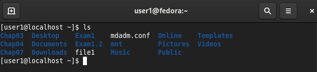

# Project 1

Start working on a project by opening [project.md](project.md).
For each problem below where __[SC]__ appears, insert a screen capture
using the Snipping Tool (Windows) or a similar tool that shows 1) the
command you typed in the Linux terminal and 2) the entire output of the
command. If the output is long and the command you typed goes off the
screen, scroll back and capture the command and a page-full of output.
__What you typed in the Linux terminal must be readable in the
pasted screen capture when this document is printed by the grader.__
Screenshots should be stored in the [media](media) directory. 
When inserting pictures, use this format ``.
Here’s a sample screen capture with an adequate text size.
The characters in your screen captures should be of this size.

Look for the TODO comments (i.e. `<!-- TODO -->`) to see
where screenshots are required.

If you have further questions about markdown syntax,
visit https://www.markdownguide.org/cheat-sheet/.

