# CIT 352: Project 1

Name: Micah Sudweeks <!-- TODO -->

1. Terminals [5]
    1. Boot Fedora and login as user 1 through GNOME Display Manager
    1. Open a terminal
    1. Login as root on tty5 __[SC]__ make sure your screen
    capture includes the “tty5” string 
        1. 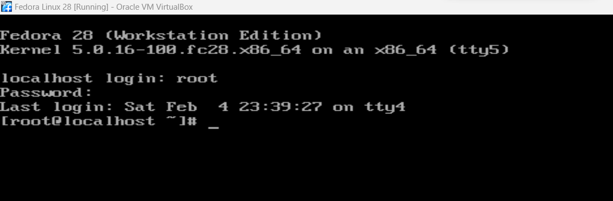 <!-- TODO -->
    1. Switch back to tty2
    1. Show all users who are logged into your system,
    including the information about which console they are logged in
    (tty2 and tty5) __[SC]__
        1. 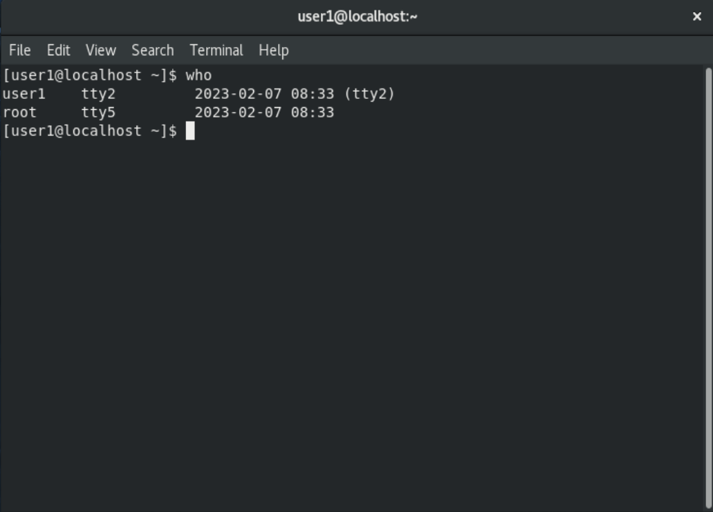 <!-- TODO -->

2. Getting Command Help [4]
    1.  Display the man page for the ls command __[SC]__
    capture the man page only, not the command
        1. 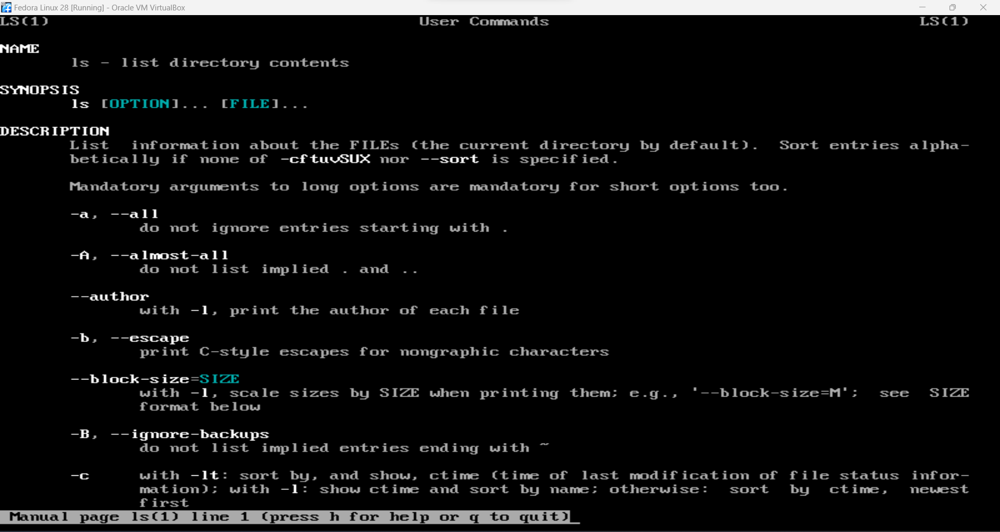 <!-- TODO -->
    1. You can’t remember the command to shut down the system.
    You know there are several commands related to halting the system.
    Using “halt” as the key word,
    list all commands (one line each) that are related
    to shutting down the system __[SC]__
        1. 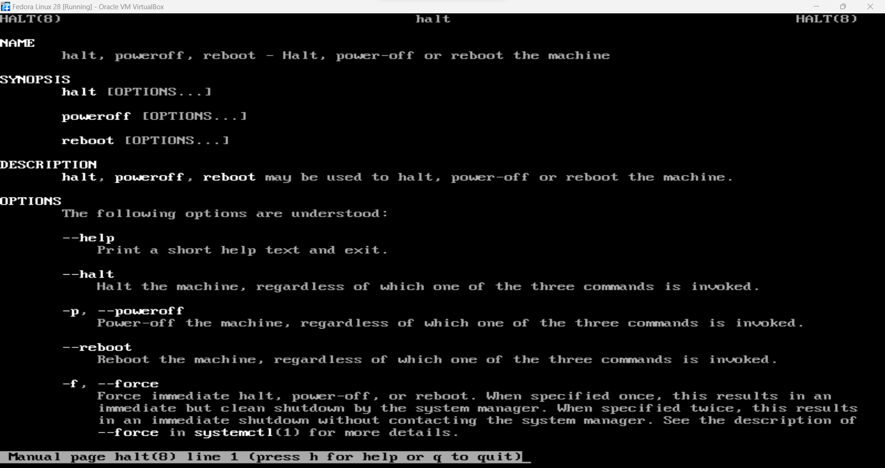 <!-- TODO -->

3. Changing Directories [5]
    1. Change the current working directory from one directory to
    another in the following sequence __[SC]__ show all of the steps below
        1. Go to your home directory.
        Note that it is not “the home directory” (/home)
        but “your home directory” 
        (or “your login directory” as it is sometimes called) 
        1. Move to /etc using the absolute pathname 
        1. From /etc, move to /etc/ssh in one step using
        the relative pathname 
        1. From /etc/ssh, move to /usr/bin in one
        step using the relative pathname 
        1. Print the absolute pathname to the current working directory 
        1. 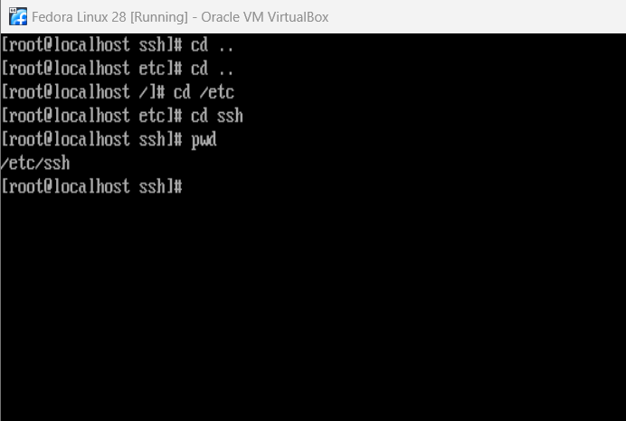 <!-- TODO -->

4. File Types [4]
    1. Determine the file type for /etc/os-release __[SC]__ 
        1.  <!-- TODO -->
    1. Display both hidden and unhidden files in
    your home directory __[SC]__ 
        1. 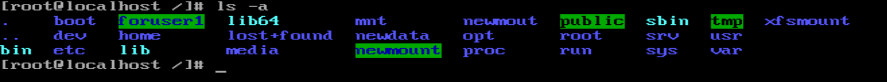 <!-- TODO -->

5. Wildcard Metacharacters [4]
    1. Using the ls command, list all files that start with the
    word “zip” under the /bin directory. Do not use grep
    or other commands to filter the output __[SC]__
        1. 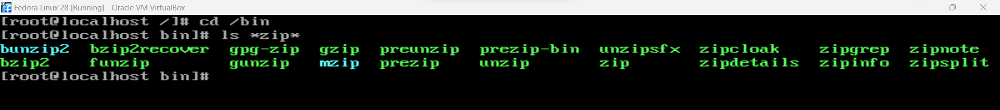 <!-- TODO -->
    1. Using the ls command, list tty30 through tty39, but not tty3,
    under the /dev directory. Do not use grep or other commands
    to filter the output __[SC]__  
        1. 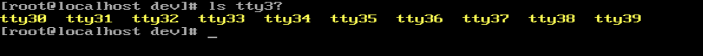 <!-- TODO -->

6. Displaying the content of a file [2]
    1. Display the last 5 lines of /usr/include/error.h __[SC]__  
        1. If the above file does not exist in your system, 
        give the following command: `sudo dnf install glibc-headers2`
        1. 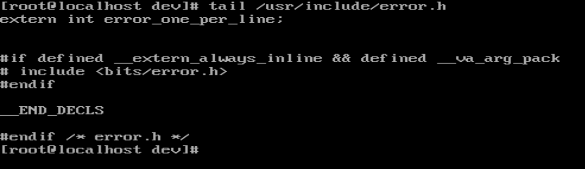 <!-- TODO -->

7. Regular Expressions [4]
    1. Print the lines which include the word “stab” or “STAB”
    (i.e. case insensitive) in /usr/include/stab.h __[SC]__    
        1. 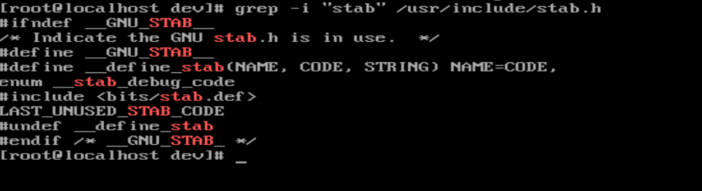 <!-- TODO -->
    1. Print the lines which include the word “f#etpos” where # is
    any one alphanumeric (number or letter)
    character in /usr/include/stdio.h __[SC]__ 
        1. 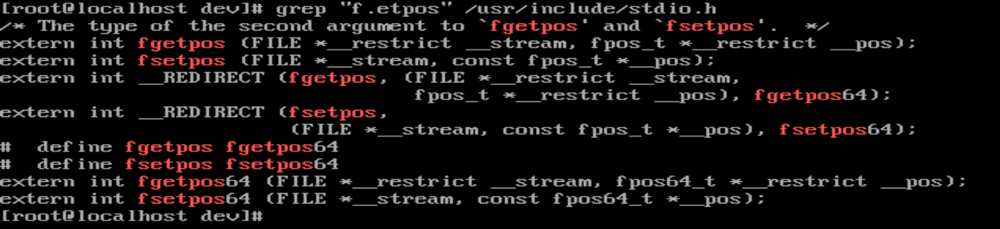 <!-- TODO -->

```
/bin
/boot
/dev
/etc
/home
/sbin
/var
```

8. vi Editor [5]
    1. Open a new file called FHS using vi and
    enter the following lines above
    1. Just below /home, add a line with /media 
    1. Move /boot and /dev lines to the bottom of the list
    1. Save the file and exit vi
    1. display the content of the FHS file __[SC]__
    no need to include the vi editing screen
        1.  <!-- TODO -->

9. Managing Files and Directories [7]
    1. While in your home directory, do the following.
    DO NOT change your working directory. __[SC]__ show all of
    the steps below. Could be in multiple screen captures.
        1. Create “Exam1” directory under your home directory 
        1. Copy /etc/hostname to Exam1 directory 
        1. Copy the hostname file in Exam1 directory to
        hostname2 in Exam1 directory 
        1. Show that both files (hostname and hostname2)
        exist under Exam1 directory 
        1. Copy Exam1 directory and its content to Exam1.1 in one command 
        1. Show that hostname and hostname2 exist under Exam1.1
        directory and no other file 
        1. Rename Exam1.1 to Exam1.2 
        1.  <!-- TODO -->

10. Finding Files [6]
    1. Using the find command, list all files whose
    filenames start with sda under /dev directory __[SC]__  
        1.  <!-- TODO -->
    1. Using the find command, list all directories (no files)
    under /dev/disk directory __[SC]__   
        1.  <!-- TODO -->
    1. Show where the more command exists in the filesystem hierarchy
    structure without using the find, ls, or locate command __[SC]__   
        1.  <!-- TODO -->

11. Linking Files [4]
    1. Create a file called file1 with your first and
    last name as its content under Exam1 directory.  
    1. Create a symbolic link “file1SymLink” for file1 under Exam1 
    1. Create a hard link “file1HardLink” for file1 under Exam1 
    1. Show the output of `ls -il file1*` command __[SC]__  
        1.  <!-- TODO -->

12. File and Directory Permissions [2]
    1. Create an empty file file2 under Exam1 
    1. Give the command to change the mode of file2 as follow: 
    `-rwxr--r--. 1 user1 user1 0 May 15 19:49 file2` __[SC]__
        1.  <!-- TODO -->

13. Filesystems [2]
    1. Show all mounted disk drives with their filesystem types __[SC]__ 
        1.  <!-- TODO -->

14. Preparation for the next hands-on problem [0]
    1. Add a new virtual hard disk by following the steps below
    IF YOU DO NOT HAVE ONE. You created two of them during class.
    Skip to the next problem if you already have one.
    1. Power off the virtual machine
    1. Add 8 GB of disk space to your VM by following the steps below
        1. 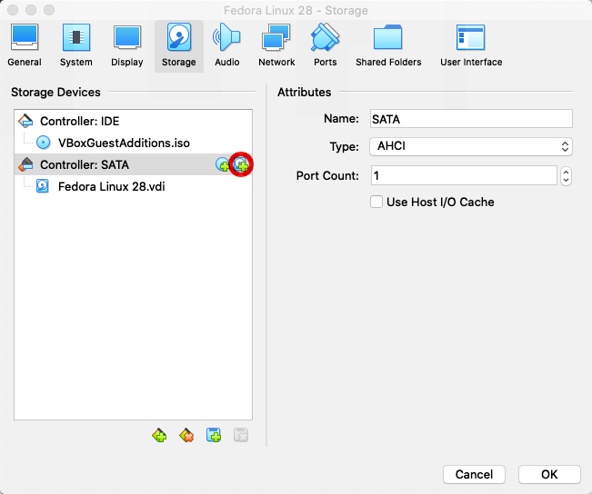
        1. 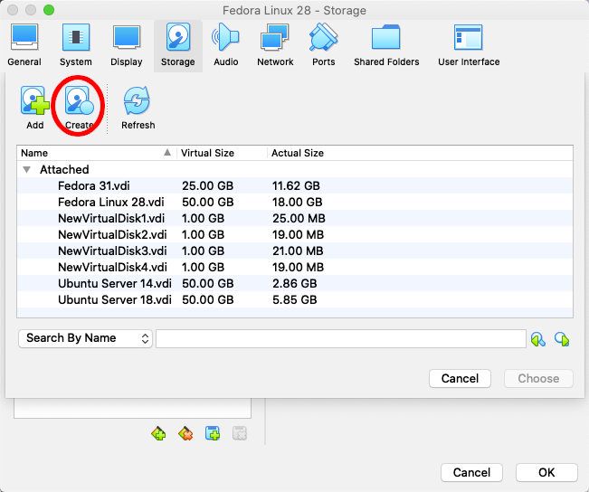
        1. 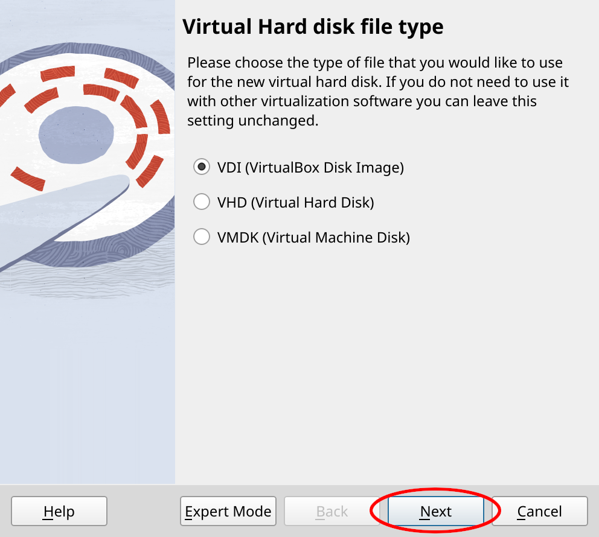
        1. 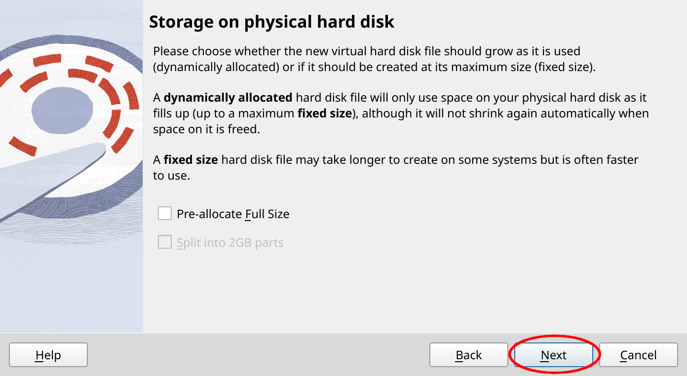
        1. 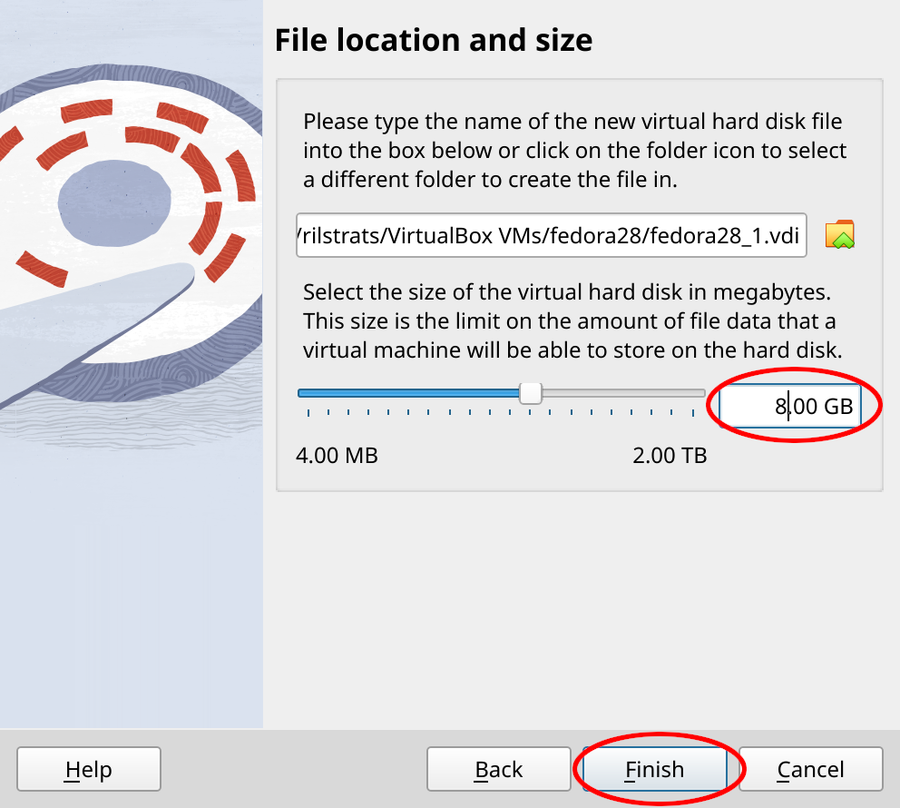
        1. 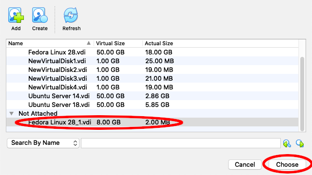
        1. 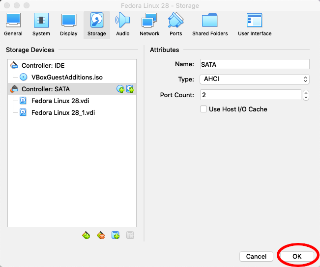
        1. 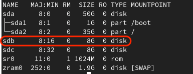
    1. In the above example, the newly created disk is called sdb.
    It may be different in your case (e.g. sdc, sdd, etc.). Use the
    appropriate device name for your environment for the exercise below.
    1. Start your VM.  

15. Partition a Disk [4]
    1. Using cfdisk, create 3 primary partitions (MBR) with 
    1 GB each on the new disk.  __[SC]__ 
        1.  <!-- TODO -->
    1. Display all the block devices in a tree structure including
    the newly created disk and partitions. It should
    look similar to the last figure in 14d. __[SC]__  
        1.  <!-- TODO -->

16. Install a Filesystem and Mount the Drive [8]
    1. Install ext4 filesystem on the first
    partition in the newly created disk 
    1. Create a mount point at /exam1/mydrive 
    1. Mount the drive at /exam1/mydrive 
    1. Insert the screen capture of all steps above __[SC]__ 
        1.  <!-- TODO -->
    1. Edit the configuration file so that the disk
    mounting will survive across reboot. __[SC]__  
        1.  <!-- TODO -->
    1. [Optional] Comment out the line you just added in the
    configuration file by adding a hashtag at the beginning of the line 

17. Working with an LVM Volumes [16] 
    1. Create two LVM Physical Volumes using the remaining partitions
    (e.g. /dev/sdb2, /dev/sdb3) you created in the previous step __[SC]__  
        1.  <!-- TODO -->
    1. Create an LVM Volume Group called “exam1vg”
    from the above PVs __[SC]__ 
        1.  <!-- TODO -->
    1. Create an LVM Logical Volume called “exam1lv” with 1.5 GB
    of storage space allocated from “exam1vg” __[SC]__ 
        1.  <!-- TODO -->
    1. Scan the physical volume information __[SC]__ 
        1.  <!-- TODO -->
    1. Install the ext4 filesystem on the logical volume __[SC]__ 
        1.  <!-- TODO -->
    1. Create a mount point at /exam1/lvdrive 
    1. Mount the drive at /exam1/lvdrive 
    1. Display all the block devices in a tree structure, including the
    logical volume being added in the previous steps __[SC]__
        1.  <!-- TODO -->

